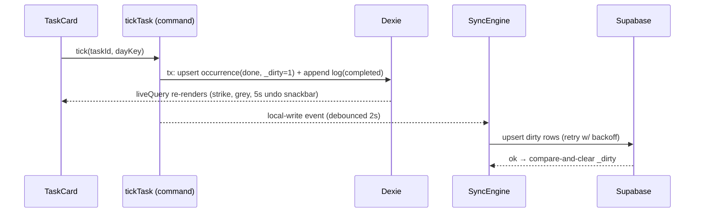

# TECH_SPEC — Routine Raccoon

**Status:** v1.1 · 6 Oct 2026 (M1–M5 built; v1.0 · 3 Oct 2026) · Owner: Engineering (VP Eng, Principal Architect, Lead Security, QA Director)
**Audience:** AI coding agents and the humans reviewing them. This is the master blueprint for _how_ we build.

**Source-of-truth order:**

1. `docs/handoff/source/PRD-daily-routine-app.md` says _what and why_.
2. `docs/handoff/README.md` (the design handoff) defines _behaviour_: copy, rules and screens.
3. This file defines _how_: architecture, contracts, guardrails.

If product behaviour conflicts, the handoff README wins. If technical decisions conflict, this file wins. Any change to a decision in this file needs a PR that edits this file.

---

## 0. Decisions at a glance

| #   | Decision      | Choice                                                                                                                                           | Rejected alternatives (why)                                                                                                                                                                                                                   |
| --- | ------------- | ------------------------------------------------------------------------------------------------------------------------------------------------ | --------------------------------------------------------------------------------------------------------------------------------------------------------------------------------------------------------------------------------------------- |
| D1  | App shape     | **Local-first** single-user app. The phone is the source of truth. Supabase is an optional backup and sync target tied to an account.            | Server-first (breaks offline use and "no account needed")                                                                                                                                                                                     |
| D2  | Runtime       | **Next.js 16 static export** (`output: 'export'`) inside a **Capacitor 8** Android shell                                                         | Plain PWA (exact-time notifications, widget and share sheet are unreliable or impossible, per handoff table). React Native/Expo (throws away the scaffold and the HTML-first design; its only gain is widget ergonomics, which is P1)         |
| D3  | Pattern       | **Feature-driven modular monolith with a hexagonal core**: pure `domain/`, adapters in `data/` and `lib/`, UI in `features/`, thin `app/` routes | Microservices (one user, one device; pure overhead)                                                                                                                                                                                           |
| D4  | Local storage | **IndexedDB via Dexie 4**, reactive reads with `liveQuery`                                                                                       | SQLite plugin (needs a native build for every dev loop; revisit only if WebView storage proves unreliable, behind the same repository API)                                                                                                    |
| D5  | State         | Dexie = persistent truth · pure selectors = derived · Zustand = ephemeral UI · no direct server state in UI                                      | Redux/RTK Query (too heavy for one user); React Query (nothing to cache, because the UI never reads the server)                                                                                                                               |
| D6  | Validation    | **Zod 4** at every trust boundary                                                                                                                | Hand-written guards (drift)                                                                                                                                                                                                                   |
| D7  | Backend       | Existing **Supabase** project "Master of Projects", schema `app_routine_raccoon` (RLS, last-write-wins trigger, soft delete) + two SQL RPCs      | Custom API server (nothing it would do that RLS + 2 RPCs don't). Edge Functions for the account jobs (each needs deploying, a service-role key and CORS, and SQL does both jobs natively; Edge Functions stay for Phase 3 Claude assist only) |
| D8  | Errors        | **Every failure has a stable code `RR-<AREA>-<NNN>`** shown on screen with the page ID (`P01`…`P15`). One typed registry.                        | Free-text errors (impossible to report or triage)                                                                                                                                                                                             |
| D9  | Monitoring    | **Sentry** (`@sentry/react`; `@sentry/capacitor` in Phase 3) with PII scrubbing; local diagnostics buffer                                        | No monitoring (silent failures)                                                                                                                                                                                                               |
| D10 | Delivery      | GitHub Actions → static web preview + Android AAB to Play Console **internal testing** track                                                     | Public Play listing (single user; not needed)                                                                                                                                                                                                 |

---

## 1. System architecture

### 1.1 Stack

| Layer        | Technology                                                                                                                           | Notes                                                                                                    |
| ------------ | ------------------------------------------------------------------------------------------------------------------------------------ | -------------------------------------------------------------------------------------------------------- |
| Language     | TypeScript 5, `strict` + `noUncheckedIndexedAccess` + `noImplicitReturns` + `noImplicitOverride`                                     | `any` is a lint error                                                                                    |
| UI           | React 19.2, Next.js 16.3 App Router, **static export**                                                                               | No Server Actions, no `proxy.ts`, no cookies, no dynamic route segments (not supported by static export) |
| Styling      | Tailwind CSS 4, tokens from the handoff in `app/globals.css` `@theme`                                                                | Fonts Outfit + Manrope bundled via `@fontsource-variable/*` (no runtime fetch, works offline)            |
| Icons        | `lucide-react` at `strokeWidth={1.8}`, 20px                                                                                          | Matches the handoff's 1.8px stroke                                                                       |
| Local DB     | Dexie 4 + `dexie-react-hooks`                                                                                                        | Schema mirrors Postgres 1:1 (snake_case)                                                                 |
| UI state     | Zustand 5                                                                                                                            | One small store per feature                                                                              |
| Validation   | Zod 4                                                                                                                                | Schemas in `domain/schemas.ts`                                                                           |
| Ordering     | `fractional-indexing`                                                                                                                | The `rank` text columns; reorders never renumber siblings                                                |
| IDs          | `crypto.randomUUID()`; UUIDv5 (`uuid`) for deterministic IDs                                                                         | See §2.4                                                                                                 |
| Drag & drop  | `@dnd-kit` (added at milestone M3)                                                                                                   | Touch + keyboard accessible                                                                              |
| Native shell | Capacitor 8 (`@capacitor/app`, `@capacitor/local-notifications`; Phase 3: share-target, social-login, secure storage, widget plugin) | `androidScheme: 'https'`                                                                                 |
| Backend      | Supabase Postgres 17 + Auth + SQL RPCs (Edge Functions only for Phase 3 assist)                                                      | Region eu-west-1 (EU/GDPR)                                                                               |
| Monitoring   | Sentry                                                                                                                               | Tags `error.code`, `page.id`, `app.env`                                                                  |
| Tests        | Vitest 5, Testing Library, fake-indexeddb, Playwright 1.63, axe-core, pgTAP                                                          | §4                                                                                                       |

### 1.2 Module layout and dependency rule

```
app/          Routes only. Each screen folder = page.tsx + error.tsx. No logic.
features/     One folder per feature (today, task-detail, task-form, …). Public API = index.ts.
domain/       Pure business rules from the handoff "Core logic". No React, no I/O, no Date.now().
data/         db/ (Dexie schema, baseline, demo seed) · commands/ (ALL writes) · hooks/ (live reads) · sync/
components/   ui/ (design-system primitives) · errors/ (RouteError, ErrorPanel, SectionBoundary)
lib/          errors/ · net/ (retry, timeout) · telemetry/ · platform/ (Capacitor adapters) · supabase/ · env.ts
supabase/     migrations/ · tests/ (pgTAP) · config.toml
tests/        e2e/ (Playwright) · setup + factories for Vitest
docs/         ERROR_CODES.md (generated) · handoff/ (PRD, handoff README, prototype, UI kit, logo)
```

```
app ─▶ features ─▶ domain
          │  └────▶ data ─▶ domain
          └───────▶ components
   (all) ─────────▶ lib            domain imports nothing except zod/uuid/fractional-indexing
```

Rules, enforced by ESLint `no-restricted-imports` and code review:

- `domain/` must not import `react`, `dexie`, `@supabase/*`, `next/*`, `lib/platform`.
- A feature may import another feature **only** through its `index.ts`.
- Components never touch Dexie or Supabase. They call a **command** (write) or a **hook** (read).
- Only `data/sync/` and `data/remote/` talk to Supabase.

### 1.3 State management strategy

| Kind                                                                                     | Lives in                                                           | Read via                                                         | Written via                                                                                  |
| ---------------------------------------------------------------------------------------- | ------------------------------------------------------------------ | ---------------------------------------------------------------- | -------------------------------------------------------------------------------------------- |
| Persistent domain data (plans, sections, tasks, occurrences, day records, log, settings) | Dexie (IndexedDB)                                                  | `data/hooks/*` (`useLiveQuery`)                                  | `data/commands/*`: one Dexie transaction, which writes the rows + the log entry + `_dirty=1` |
| Derived data (Today list, totals, headline, Extra Support count, Progress stats)         | Nowhere (computed)                                                 | Pure selectors in `domain/` (`buildToday`, …), memoised in hooks | n/a                                                                                          |
| Ephemeral UI (filter, collapsed sections, open sheet, drag state, undo window, toasts)   | Zustand per feature                                                | `useXStore(selector)`                                            | Store actions                                                                                |
| Device-only runtime (running timer, last seen `day_key`, sync cursors)                   | Dexie `kv` / `sync_state` tables (never synced)                    | hooks                                                            | commands                                                                                     |
| Server data                                                                              | **Never read by UI.** The sync engine reconciles Supabase ↔ Dexie. | n/a                                                              | n/a                                                                                          |

Auth flows (email lookup, sign-in) are the only UI-initiated network calls. They go through `data/remote/*` gateways with retry and error codes.

### 1.4 Routes and page IDs

Static export can't serve dynamic segments for client-generated IDs, so entity IDs travel as query params. **Every route folder contains `page.tsx` and `error.tsx`.** A unit test fails the build if one is missing (§1.5).

| Page ID | Route                           | Screen (handoff #)                                | Overlays rendered inside it                  |
| ------- | ------------------------------- | ------------------------------------------------- | -------------------------------------------- |
| P00     | (root)                          | `layout.tsx`, `global-error.tsx`, `not-found.tsx` | toasts, timer bar                            |
| P01     | `/`                             | Today (1–5)                                       | Plan sheet, section ⋯ menu, new-plan prompt  |
| P02     | `/task?id=`                     | Task detail (6–9)                                 | Task ⋯ menu, copy/move sheet, delete confirm |
| P03     | `/task/edit?id=` or `?section=` | New / Edit task (10, 11)                          | Paste dialog, recurrence sheet               |
| P04     | `/section/edit?id=` or `?plan=` | Add / edit section (12, 13)                       | Recurrence sheet                             |
| P05     | `/plans/sections?plan=`         | Sections manager (14)                             | —                                            |
| P06     | `/settings`                     | Settings (15, 16)                                 | Reset-time sheet                             |
| P07     | `/progress`                     | Progress (17)                                     | —                                            |
| P08     | `/log?task=`                    | Log · Task activity (18)                          | —                                            |
| P09     | `/archive`                      | Archive (19)                                      | —                                            |
| P10     | `/day-complete`                 | Day complete (20)                                 | —                                            |
| P11     | `/help`                         | Help (21) and the **error-code reference**        | —                                            |
| P12     | `/privacy`                      | Privacy (21)                                      | —                                            |
| P13     | `/auth`                         | Auth, all steps (22)                              | Google chooser, "Two copies of your day"     |
| P14     | `/account`                      | Account (23)                                      | —                                            |
| P15     | `/setup`                        | Setup wizard (R12, not designed yet)              | —                                            |

### 1.5 Error-code system (product requirement: every page carries error codes)

**Format:** `RR-<AREA>-<NNN>`, e.g. `RR-DB-002`. Areas: `APP` (unexpected or render), `DB` (on-device data), `NET`, `SYNC`, `AUTH`, `VAL` (input), `IMP` (paste/import), `MED` (video), `TMR` (timer), `NTF` (notifications), `PLAT` (native), `EXP` (export), `AST` (Claude assist, Phase 3).

**Rules (non-negotiable):**

1. **One registry.** `lib/errors/codes.ts` is the only place codes are defined, `as const`, so `ErrorCode` is a string-literal union and an unknown code doesn't compile. Each entry has `area`, `title`, `userMessage`, `severity`, `retryable` and `devHint`.
2. **Every user-visible failure shows its code and the page ID.** That covers route error screens, inline panels, toasts and validation messages. Format: `RR-DB-002 · P01`.
3. **Every route has an `error.tsx`** that renders `<RouteError pageId="Pxx">`. It shows the code, Try again (`retry()`), Go to Today and Copy details (code, page, error ID, version, time). `global-error.tsx` covers the root layout (`P00`). `not-found.tsx` shows `RR-APP-003`.
4. **Every screen renders inside `<ScreenRoot pageId>`.** It stamps `data-page-id` and wires fault injection for tests.
5. **No silent failures.** Every `catch` must do one of three things: rethrow an `AppError` with a code, return `err(AppError)`, or call `reportError()`. `window.onerror` and `unhandledrejection` are reported as `RR-APP-002` and shown as a toast.
6. **`toAppError(unknown)`** maps platform errors to codes (e.g. `QuotaExceededError` → `RR-DB-003`, `TypeError: Failed to fetch` → `RR-NET-001`, chunk-load failure → `RR-APP-005`, Postgres `23514` → `RR-SYNC-003`).
7. **Codes are forever.** Never reuse or renumber a code. Retired codes stay in the registry with `retired: true`.
8. **Docs are generated.** `npm run errors:doc` writes `docs/ERROR_CODES.md`. CI runs `errors:check` and fails if it is stale. The Help screen (P11) renders the same registry so the user can look up any code.
9. **Telemetry.** Every reported error is tagged `error.code` + `page.id` in Sentry, so a code the user reads out maps straight to an issue.
10. **Fault injection.** Builds with `NEXT_PUBLIC_ENABLE_FAULTS=1` (never production; the build refuses it) accept `?__fault=RR-DB-001` on any route. E2E uses this to prove every page shows a code.

**Initial catalog** (the canonical list is `lib/errors/codes.ts` → `docs/ERROR_CODES.md`):

| Area                               | Codes                                                                                                                                                                                                                                                                                                               |
| ---------------------------------- | ------------------------------------------------------------------------------------------------------------------------------------------------------------------------------------------------------------------------------------------------------------------------------------------------------------------- |
| APP                                | 001 screen crashed · 002 background error · 003 page not found · 004 link missing a parameter · 005 newer version ready (chunk load) · 006 app misconfigured                                                                                                                                                        |
| DB                                 | 001 can't open data · 002 couldn't save · 003 storage full · 004 data upgrade failed · 005 item no longer exists · 006 unreadable saved data (row skipped)                                                                                                                                                          |
| NET                                | 001 offline · 002 timed out · 003 rate limited · 004 server error                                                                                                                                                                                                                                                   |
| SYNC                               | 001 push failed · 002 pull failed · 003 server refused a change (quarantined) · 004 combining copies failed                                                                                                                                                                                                         |
| AUTH                               | 001 wrong email/password · 002 too many tries · 003 code invalid/expired · 004 sign in again · 005 Google sign-in failed · 006 email check unavailable · 007 account deletion failed · 008 accounts not configured in this build · 009 password too weak · 010 couldn't send the code · 011 check the email address |
| VAL                                | 001 name required · 002 minutes 1–600 · 003 only YouTube/TikTok links · 004 invalid time · 005 primary plan protected · 006 plan has no sections · 007 a section needs a Day Plan · 008 can't be the primary · 009 all levels taken · 010 pick a section                                                            |
| IMP                                | 001 nothing to add · 002 paste too long (200 lines)                                                                                                                                                                                                                                                                 |
| MED · TMR · NTF · PLAT · EXP · AST | MED-001 video failed · TMR-001 timer alert not set · NTF-001 notifications off · NTF-002 reminders not scheduled · PLAT-001 not available here · EXP-001 export failed · AST-001 daily limit · AST-002 drafting unavailable                                                                                         |

**Page → page-specific codes** (every page can also show the common set: APP-001/002/005, DB-001/002/003/006, NET-001…004):

| Page                                          | Specific codes                                              |
| --------------------------------------------- | ----------------------------------------------------------- |
| P00                                           | APP-006, DB-004                                             |
| P01 Today                                     | DB-005, TMR-001, SYNC-001, VAL-001 (new plan name)          |
| P02 Task detail                               | APP-004, DB-005, MED-001, TMR-001, VAL-006                  |
| P03 Task form                                 | APP-004, DB-005, VAL-001…004, IMP-001, IMP-002, AST-001/002 |
| P04 Section form                              | APP-004, DB-005, VAL-001, VAL-004                           |
| P05 Sections manager                          | APP-004, DB-005, VAL-005, VAL-006                           |
| P06 Settings                                  | VAL-001, VAL-004, VAL-005, NTF-001, NTF-002, EXP-001        |
| P07 Progress · P09 Archive · P10 Day complete | DB-005                                                      |
| P08 Log                                       | APP-004, DB-005                                             |
| P11 Help · P12 Privacy                        | (common only)                                               |
| P13 Auth                                      | AUTH-001…006, AUTH-008…011, SYNC-004                        |
| P14 Account                                   | AUTH-004, AUTH-007, AUTH-008, SYNC-001…004, EXP-001         |
| P15 Setup                                     | VAL-001, VAL-002                                            |

### 1.6 Resilience patterns

- **Error boundaries at three levels:** `global-error.tsx` (root) → route `error.tsx` (screen) → `<SectionBoundary>` built on `next/error` `catchError` (widget). A broken video embed or one bad section never takes down Today.
- **`Result<T, AppError>`** (`lib/errors/result.ts`) for expected failures in commands and gateways. Throwing is for the unexpected.
- **Retry:** `withRetry()` (`lib/net/retry.ts`) uses exponential backoff with full jitter (base 500 ms, ×2, cap 30 s, 5 attempts by default). It retries only `retryable` codes and honours `AbortSignal`. `withTimeout()` (default 15 s) maps to `RR-NET-002`.
- **Graceful degradation:**
  - Supabase env missing → account features disabled (`RR-AUTH-008`); the day still works.
  - IndexedDB unavailable → full-screen `RR-DB-001` with guidance.
  - A row with invalid JSON → skipped and reported (`RR-DB-006`), never a crash.
- **Durable storage:** call `navigator.storage.persist()` on first run. Export is always available.

---

## 2. Data & API design

### 2.1 Entities (cloud schema `app_routine_raccoon`, already live)

```mermaid
erDiagram
  day_plans ||--o{ plan_sections : contains
  sections  ||--o{ plan_sections : "appears in"
  sections  ||--o{ tasks : holds
  tasks     ||--o{ task_occurrences : "per day_key"
  day_records }o--|| user : "per day_key"
  log_entries }o--|| user : append-only
  user_settings ||--|| user : one
```

| Table              | Key                               | Purpose / notable columns                                                                                                                                      |
| ------------------ | --------------------------------- | -------------------------------------------------------------------------------------------------------------------------------------------------------------- |
| `day_plans`        | `id`                              | `kind` primary/survival/custom; `survival_level` 1–3 iff survival; `rank`; exactly one live primary (unique partial index)                                     |
| `sections`         | `id`                              | `color`, `start_time` "HH:MM", `recurrence` JSON, `notify_on_start`, `notify_before_close`, `closing_lead_minutes`                                             |
| `plan_sections`    | `(plan_id, section_id)`           | Links a section into several plans, with its own `rank`                                                                                                        |
| `tasks`            | `id`                              | `section_id`, `rank`, `minutes` 1–600, `hard`, `never_shrink`, `steps` JSON, `smaller_versions` JSON, `mantra`, `notes`, `video_url`, `location`, `recurrence` |
| `task_occurrences` | `id`, unique `(task_id, day_key)` | `status` pending/done/skipped, `checked_step_ids`, `minutes_credited`, `survival_level_at_completion`, `carried_from_day_key`                                  |
| `day_records`      | `(user_id, day_key)`              | `survival_on`, `survival_level`, `closed_at`                                                                                                                   |
| `log_entries`      | `id`                              | Append-only (no UPDATE grant). `kind` ∈ completed, uncompleted, skipped, added, edited, imported, survival, closed                                             |
| `user_settings`    | `user_id`                         | `settings` JSON                                                                                                                                                |

Server conventions (enforced by the `stamp` trigger, `make_synced()` and grants):

- Client-generated `id`, `created_at` and `updated_at`.
- Last-write-wins on `updated_at`: a stale UPDATE is silently dropped.
- `server_seq` / `server_updated_at` are server-owned.
- Soft delete via `deleted_at`; no DELETE grant.
- `user_id` defaults to `auth.uid()` and is immutable.
- RLS is FORCED, with owner-only policies.

**Proposed migration** (`supabase/migrations/20261003090000_routine_raccoon_hardening.sql`, _not applied_; needs approval):

1. Clamp `updated_at` to `now() + 5 min` in the trigger. Closes the clock-skew row-freeze issue (security §3.6).
2. Replace `consume_assist_quota(daily_limit)` with a server-owned limit (security §3.6).
3. Add `sections.length_override_minutes smallint null` (1–600), for the section length override.
4. Add `day_records.plan_id uuid null`, the non-survival plan picked for that day (null = primary), so the Travelling pick syncs and resets daily.

Until it is applied, `HARDENING_MIGRATION_APPLIED = false` in `data/sync/mapping.ts` keeps columns 3–4 local-only (never pushed, preserved on pull). After applying: flip the flag and regenerate `database.types.ts`.

**Proposed migration** (`supabase/migrations/20261004120000_routine_raccoon_account_rpcs.sql`, _not applied_; needs approval): the two account RPCs in §2.7, a private rate-limit table, and owner-only DELETE policies used by `delete_my_data()` (clients still have no DELETE grant). The app already calls these RPCs and degrades to `RR-AUTH-006` / `RR-AUTH-007` while they are missing.

### 2.2 JSON column contracts (`domain/schemas.ts`, parsed with Zod at every trust boundary: remote pull, import, schema upgrade; settings on every read)

```ts
Recurrence  = { kind: 'every day'|'every week'|'every month'|'custom',
                days: (0..6)[]        // 0 = Monday
                n: int ≥1,            // INTERVAL ("every n {per}"), Google-Calendar semantics
                per: 'day'|'week'|'month'|'year',
                ends: 'never'|'count'|'date', count?: int, until?: 'YYYY-MM-DD',
                start?: 'YYYY-MM-DD' } // anchor for intervals; defaults to created day
Steps       = { id: string, text: string }[]
SmallerVersion (tasks.smaller_versions) = { minutes?: int, steps?: Steps, text?: string }
CheckedStepIds = string[]
Settings    = { showLevel=true /* "Ask which kind of day it is" prompt on Today */, roll=false,
                firstStep=false, exportArchive=true, resetAt='00:00' (24h stored),
                longAt=20, keepSurvivalOvernight=false, survivalName='Survival Mode',
                defaultLevel=2, survivalCountsAsFullDay=false }   // every key has a default
```

`normalizeSettings()` (`domain/settings.ts`) also maps the live rows' legacy keys (`showLevelPicker`, `carryOverUnfinished`, `exportIncludesArchive`, `extraSupportThresholdMinutes`, `defaultSurvivalLevel`, `survivalDayCountsAsFullDay`) and falls back per key, so one bad value never resets the rest.

> **Resolved ambiguity:** the handoff label rule prints `"{n}× per {per}"`, but the prototype's own seed reads "Every 2 weeks · Mon, Wed, Fri" and the user asked for Google-Calendar repeats. We implement `n` as an **interval**. The label reads `"every 2 weeks"`; everything else follows `recLabel` exactly.

### 2.3 Local database (Dexie)

- Same tables, same column names.
- Local rows omit `user_id`, `server_seq` and `server_updated_at`, and add `_dirty: 0|1` (numeric so IndexedDB can index it).
- Local primary keys: `day_records` → `day_key`; `user_settings` → `key='me'`.
- Extra local-only tables: `kv` (timer, last `day_key`, dismissed prompts, `sync_owner`, `last_synced_at`, `pending_initial_pull`, `sync_quarantine`; each value Zod-checked on read) and `sync_state` (pull cursor per table).
- Schema changes bump the Dexie version with an `upgrade()` step. A failure there maps to `RR-DB-004`. v2 fills `sections.length_override_minutes` and `day_records.plan_id` with `null` on v1 rows without marking them dirty.

### 2.4 Day lifecycle (handoff "Regeneration")

- `day_key = local date of (now − resetAt)`, computed with wall-clock components (DST-safe), in `domain/time.ts`.
- **Occurrences are lazy.** Today is computed from definitions + recurrence. A `task_occurrences` row is written only on interaction (tick, skip, step check, carry-over).
- **Deterministic IDs prevent cross-device duplicates:** `occurrence.id = uuidv5(NS, task_id + ':' + day_key)`; `day_records` is keyed by `day_key`.
- **Rollover** runs on app start, on resume and on a timer set for the next boundary:
  - Survival turns off unless `keepSurvivalOvernight` is on.
  - The selected plan returns to primary.
  - If `roll` is on, missed occurrences carry over (`carried_from_day_key`), but **only from the day directly before**: after days away, an old list is not "yesterday".
  - Notifications are rescheduled.
- **Close the day** marks the day's record `closed_at` and writes a `closed` log entry ("{ticked} of {total} ticked"). The app then shows the next day early: `effectiveDayKey(calendar, closed)` is the calendar day + 1 once the calendar day is closed, never more than one day ahead of the clock. Rollover runs into that day as usual.
- **The day's plan** is `day_records.plan_id` (null = primary) plus `survival_on`/`survival_level`. With `showLevel` on, Today asks "Which kind of day is it?" until a plan is picked or the prompt is hidden for the day.

### 2.5 Internal write API: commands

Every write is a command in `data/commands/`. Signature: `(input) => Promise<Result<Output, AppError>>`. Each command runs inside `runCommand()`, which does five things:

1. Opens one Dexie `rw` transaction.
2. Validates input with Zod (failure → `RR-VAL-*`).
3. Writes rows with a fresh `updated_at` and `_dirty=1`.
4. Appends the log entry from `domain/log.ts` (titles and metas per the handoff).
5. On commit, emits `local-write`, which schedules a sync.

Errors map to `RR-DB-002/003`.

| Group              | Commands                                                                                                                                                                                       |
| ------------------ | ---------------------------------------------------------------------------------------------------------------------------------------------------------------------------------------------- |
| Day                | `tickTask`, `untickTask`, `skipTaskToday`, `toggleStep`, `pickPlan`, `pickSurvivalLevel`, `setSurvivalMode`, `closeDay`, `rolloverDay`, `dismissDayPrompt`                                     |
| Tasks              | `createTask` (+ survival copies), `updateTask`, `patchTask`, `deleteTask`, `duplicateTask`, `copyTaskToPlan`, `moveTask` (reorder and move), `importPastedList`                                |
| Sections           | `createSection`, `updateSection`, `duplicateSection`, `linkSectionToPlan`, `moveSectionToPlan`, `removeSectionFromPlan`, `reorderSection`, `archiveSection`, `restoreSection`, `deleteSection` |
| Plans              | `createPlan`, `renamePlan`, `setPlanDescription`, `makePrimary`, `setSurvivalMembership`, `duplicatePlan`, `reorderPlan`, `archivePlan`, `deletePlan`, `restorePlan`                           |
| Timer · device     | `startTimer`, `stopTimer`, `markTimerAlerted`, `writeKvCommand` (device-only: not synced, not logged)                                                                                          |
| Settings / account | `updateSettings`, `prepareExport` (JSON, tasks CSV, log CSV), `combinePlans`, `adoptAllRows`, `clearSyncedData`, `forgetAccount`, `logAccountEvent`, `retryQuarantined`                        |

Ranks: `rankForPosition()` places an item between its neighbours. When two siblings share a key (e.g. after combining copies) it renumbers the siblings in the same transaction; reads tie-break equal ranks by `id`.

### 2.6 Sync protocol (`data/sync/`)

The sync engine depends on a `SyncGateway` port. The adapters are `SupabaseGateway` (production) and `MemoryGateway` (tests; it emulates the trigger's last-write-wins semantics).

- **Push:** walk the tables in FK order: `day_plans`, `sections`, `plan_sections`, `tasks`, `task_occurrences`, `day_records`, `user_settings`, `log_entries`.
  - Take dirty rows in batches of 200 and `upsert` them on the primary key. `log_entries` uses `ignoreDuplicates` (`ON CONFLICT DO NOTHING`), because there is no UPDATE grant.
  - After success, clear `_dirty` **only if the row's `updated_at` is unchanged** (compare-and-clear), so edits made mid-push are never lost.
- **Pull:** per table, `server_seq > cursor ORDER BY server_seq LIMIT 500` until drained.
  - If the local row is dirty and **newer** than the remote row, keep it: it will be pushed and the server arbitrates.
  - If the remote row is newer than a dirty local row, the remote row wins locally too (the server would drop the stale push anyway). This keeps phone and server convergent once the cursor has passed.
  - Otherwise overwrite it with the remote row. Tombstones apply as-is (unknown tombstoned rows are not created locally) and are purged locally after 30 days once synced.
- **Occurrences** are unique on `(task_id, day_key)`. If another device created the same day's occurrence under a different id, the push gets `23505`: the row is deferred, the pull re-keys the local row to the server's id (keeping the newer content), and a second push pass sends it.
- **One primary plan:** dirty `day_plans` are pushed demotions first, so "make primary" never trips the unique primary index mid-batch.
- **Triggers:**
  - App start and resume.
  - 2 s after a local write (debounced).
  - The `online` event.
  - Every 5 min while in the foreground.
  - Sync is single-flight (one run at a time).
- **Failures:**
  - Retryable codes (`NET-*`, `SYNC-001/002`) back off and retry.
  - A row refused by a constraint is quarantined with `RR-SYNC-003` and surfaced on Account. It never blocks other rows.
- **Which account this phone syncs with:** `kv.sync_owner`. Sync runs only when signed in **and** the session user equals `sync_owner`. First sign-in plans the link (`planFirstSync`): same owner → just sync; saved copy empty → keep the phone's (auto); phone pristine → use the saved copy (auto); otherwise ask.
- **"Two copies of your day"** (first sign-in with local data):
  - **Combine:** union by ID. If both copies have a primary plan, keep the server's: re-point local `plan_sections` to it (ranked after the server's) and tombstone the local primary.
  - **Use the saved copy:** clear local data, then pull. `pending_initial_pull` makes baseline and bootstrap wait, so an interrupted pull resumes instead of seeding a second routine.
  - **Keep this phone's:** tombstone all server rows, then push local.

### 2.7 Remote API surface

| Endpoint                                         | Caller                        | Auth                                                                                                                      | Contract                                                                            |
| ------------------------------------------------ | ----------------------------- | ------------------------------------------------------------------------------------------------------------------------- | ----------------------------------------------------------------------------------- |
| PostgREST: the 8 tables above                    | Sync engine only              | User JWT + RLS                                                                                                            | Typed by `lib/supabase/database.types.ts`                                           |
| RPC `lookup_account(p_email)`                    | Auth screen (550 ms debounce) | Publishable key (`anon`); 10/min per IP, 5/min per email (sha256 buckets in a private table), else `PT429` → `RR-NET-003` | `{exists, providers[], firstName?}`, uniform ~100 ms timing                         |
| RPC `delete_my_data()`                           | Account screen                | User JWT (`authenticated`)                                                                                                | Hard-deletes **this app's rows** for the caller. The login stays (see note)         |
| Edge Function `assist-smaller-version` (Phase 3) | Task form                     | User JWT; `consume_assist_quota()`                                                                                        | `POST {task}` → `{name, minutes, steps, text}`. The Anthropic key stays server-side |

> **Shared `auth.users`:** the project's logins are shared with the owner's other apps. "Delete account" therefore deletes the saved copy of the day (this app's data), signs out and forgets the link. It does not delete the login, which other apps use. A login made in another app also reads as "Account found" and can sign in here.

The Phase 3 Edge Function returns one envelope: `{ ok: true, data } | { ok: false, error: { code: 'RR-…', message } }`, validated with Zod. CORS allows only `https://localhost` (Capacitor) and the staging origin.

### 2.8 Data flow: ticking a task



---

## 3. Security & privacy

**Threat model.** One user, but the data is sensitive: mental-health-adjacent state ("Zero energy" days, an "Avoiding this" list). The assets are the routine data and the account. The main threats:

- Account takeover.
- Cross-app leakage (the Supabase project is shared with other apps).
- Account enumeration.
- Injection via notes and video links.
- A lost phone.
- Supply chain compromise.
- Secret leakage.

### 3.1 Authentication (Supabase Auth, optional)

- Methods: email + password; 6-digit email OTP (10-min expiry, 30 s resend lock); Google.
  - On Android, Google uses the system Credential Manager → `signInWithIdToken` with a nonce.
  - On the web, it uses OAuth with PKCE.
- Sessions: supabase-js auto-refresh.
  - Phase 2 (web build): storage is browser `localStorage`.
  - Phase 3 (Android): storage adapter backed by **Android Keystore** (secure-storage plugin).
- Required project settings:
  - Turn **leaked-password protection** on (the advisor currently flags it off).
  - Minimum password length 10. The app also requires a number or a symbol (`domain/auth.ts`, `RR-AUTH-009`).
  - OTP length 6, expiry 600 s.
- The design's email lookup ("Account found") is an **account-enumeration vector**. We accept it as a product trade-off, with mitigations:
  - Rate limit of 10/min per IP hash and 5/min per email hash, enforced in SQL by `lookup_account`.
  - Response limited to `exists`, `providers` and first name.
  - Uniform timing.
  - Lookups logged with hashes only.

### 3.2 Authorization

- RLS is **FORCED** on every table, with owner-only `select`, `insert` and `update` policies.
- No DELETE grant. `anon` is revoked.
- `user_id` is immutable (trigger).
- Internals live in `app_routine_raccoon_private`, which is not exposed.
- `make_synced()` makes it impossible to add a table without RLS. Every new table **must** go through it.
- The shared project shares `auth.users` across apps. RLS keys on `user_id`, so rows never cross users.
- pgTAP tests prove that user B can't read or modify user A's rows (§4).
- Service-role/secret keys exist **only** in CI (and Phase 3 Edge Function secrets); never in the client bundle. The two account RPCs are `security definer` with a pinned `search_path` and act only on `auth.uid()`.

### 3.3 Encryption

- In transit: TLS 1.2+ (Supabase, Sentry).
- At rest:
  - Server: Supabase-managed AES-256.
  - Device: the Android app sandbox + file-based encryption.
  - Tokens: Keystore (Phase 3).
- Export files are plain JSON. The export screen says so.
- Android backup: `dataExtractionRules` allow device-to-device transfer and E2E-encrypted cloud backup only.

### 3.4 Environment variables & secrets

| Variable                                                                                                                | Where                                       | Public?                                                   |
| ----------------------------------------------------------------------------------------------------------------------- | ------------------------------------------- | --------------------------------------------------------- |
| `NEXT_PUBLIC_SUPABASE_URL`, `NEXT_PUBLIC_SUPABASE_PUBLISHABLE_KEY`                                                      | `.env` / CI vars                            | Yes (publishable by design; guard rejects `sb_secret_`)   |
| `NEXT_PUBLIC_APP_ENV` (`local`/`staging`/`production`)                                                                  | `.env` / CI                                 | Yes                                                       |
| `NEXT_PUBLIC_SENTRY_DSN`                                                                                                | CI vars                                     | Yes                                                       |
| `NEXT_PUBLIC_ENABLE_FAULTS`                                                                                             | test builds only                            | Yes. **The build fails if set with `APP_ENV=production`** |
| `SUPABASE_SECRET_KEY`, `ANTHROPIC_API_KEY`                                                                              | Supabase Edge Function secrets              | **No**                                                    |
| `SUPABASE_ACCESS_TOKEN`, `SUPABASE_DB_PASSWORD`, `SENTRY_AUTH_TOKEN`, `ANDROID_KEYSTORE_*`, `PLAY_SERVICE_ACCOUNT_JSON` | GitHub Actions secrets (environment-scoped) | **No**                                                    |

- All `NEXT_PUBLIC_*` values are validated by `lib/env.ts` (Zod) and referenced literally so Next.js can inline them.
- `.env*` is git-ignored (except `.env.example`).
- `gitleaks` runs in CI.

### 3.5 Client hardening

- CSP via `<meta>` in production builds:
  - `default-src 'self'`
  - `frame-src` YouTube-nocookie and TikTok only
  - `connect-src` Supabase + Sentry
  - `object-src 'none'`, `base-uri 'none'`
- Video links: we parse the URL, check the host against the allowlist, extract the ID and **build the embed URL ourselves**. User URLs are never embedded directly. iframes are sandboxed.
- No `dangerouslySetInnerHTML` (lint error). Notes are plain text.
- Capacitor: empty `allowNavigation`; external links open in the system browser; WebView debugging off in release.

### 3.6 Findings from the live-project review (action items)

| #   | Finding                                                                                        | Severity | Fix                                                  |
| --- | ---------------------------------------------------------------------------------------------- | -------- | ---------------------------------------------------- |
| S1  | `consume_assist_quota(daily_limit)` lets the client choose its own limit (up to 200)           | Medium   | Hardening migration: no parameter, limit server-side |
| S2  | A client `updated_at` far in the future wins every later write ("row freeze")                  | Medium   | Hardening migration: clamp to `now() + 5 min`        |
| S3  | Leaked-password protection disabled                                                            | Low      | Dashboard → Auth → Password security                 |
| S4  | Scaffold's cookie SSR auth (`proxy.ts`, `lib/supabase/server.ts`) can't run in a static export | n/a      | Removed; client-side session (Keystore in Phase 3)   |

### 3.7 Privacy

- No analytics and no third-party trackers.
- Sentry 11 runs with `dataCollection` fully off (no user info, cookies, headers, bodies or query params), no session replay, and a `beforeSend` scrubber. Task names, notes and emails never leave the device in telemetry; codes and stack traces do.
- Export (portability) and Delete account (erasure of this app's data, hard delete) satisfy GDPR for this app. Deleting the shared login is a separate, manual step (§2.7 note). Data stays in the EU region.
- The privacy copy is rewritten per the handoff: data lives on the phone; an optional account saves a copy to the server; nothing is shared.

### 3.8 Supply chain

- `npm ci` from the lockfile.
- Dependabot weekly (npm + actions).
- `npm audit --audit-level=high` in CI.
- Actions pinned to tagged majors; Dependabot proposes SHA pins.
- No `postinstall` scripts from new dependencies without review.

---

## 4. Testing strategy

| Level            | Tool                                                                                                                    | Scope                                                                                                                                                                                                                                                                                                                                                                                                                | Location                     | Gate                                             |
| ---------------- | ----------------------------------------------------------------------------------------------------------------------- | -------------------------------------------------------------------------------------------------------------------------------------------------------------------------------------------------------------------------------------------------------------------------------------------------------------------------------------------------------------------------------------------------------------------- | ---------------------------- | ------------------------------------------------ |
| Static           | `tsc --noEmit`, ESLint (type-aware: `no-floating-promises`, `switch-exhaustiveness-check`, `no-explicit-any`), Prettier | Everything                                                                                                                                                                                                                                                                                                                                                                                                           | n/a                          | 0 errors                                         |
| Unit             | Vitest (node)                                                                                                           | `domain/*`, `lib/*`: paste parser (table-driven, "implement exactly"), recurrence, `day_key` incl. DST (TZ pinned to Europe/Berlin), Today selector/totals/headline, emoji map, retry/backoff, error normalisation                                                                                                                                                                                                   | `**/*.test.ts` beside source | **domain ≥ 95% lines & branches**; overall ≥ 80% |
| Component        | Vitest (jsdom) + Testing Library                                                                                        | UI primitives, `RouteError` shows code + page ID                                                                                                                                                                                                                                                                                                                                                                     | `*.test.tsx`                 | Part of coverage                                 |
| Integration      | Vitest + `fake-indexeddb`                                                                                               | Commands (tick writes occurrence + log + dirty in one tx), sync engine vs `MemoryGateway` (retry, quarantine, compare-and-clear), merge strategies                                                                                                                                                                                                                                                                   | `data/**/*.test.ts`          | Required for every command                       |
| Architecture     | Vitest                                                                                                                  | Every `app/**/page.tsx` has `error.tsx` with the registered page ID; every route is in the page registry; error docs current                                                                                                                                                                                                                                                                                         | `tests/architecture.test.ts` | Blocks merge                                     |
| Database         | pgTAP via `supabase test db` (local stack)                                                                              | RLS isolation (user A vs B), no DELETE, last-write-wins drop, timestamp clamp, one primary plan                                                                                                                                                                                                                                                                                                                      | `supabase/tests/*.sql`       | On `supabase/**` changes                         |
| E2E              | Playwright (Chromium, 412×868 mobile viewport) against the static export served locally, with faults enabled            | Smoke every route (real ids) · **forced failure on every route shows `RR-…` + page ID** · tick → 5 s undo · plan switch drops total · paste → dialog → import · task and section create · archive/restore · reorder (buttons, keyboard drag with announcements) · timer · Progress and Log · close the day · Settings persist · export file · setup wizard · offline mode · axe: no serious/critical a11y violations | `tests/e2e/`                 | Blocks merge                                     |
| Native (Phase 3) | Maestro on Android emulator (nightly) + release checklist                                                               | Exact-time notification fires, timer survives background, share intent opens paste dialog, widget tick                                                                                                                                                                                                                                                                                                               | `tests/native/`              | Blocks release                                   |

**Rules:**

- Tests never use real user data. Fixtures come from the prototype seed (`data/db/seed-demo.ts`) and `tests/factories.ts`.
- A bug fix lands with a test that fails before the fix.
- Time and randomness are injected (`now`, `random`) in domain code. No `Date.now()` in `domain/`.
- **Definition of done for a PR:** `npm run verify` is green; new codes registered; new screens have `error.tsx` + an E2E smoke; the spec updated if a decision changed.

---

## 5. DevOps & deployment

### 5.1 Environments

|            | Local                                                               | Staging                                                                                                                           | Production                                                                              |
| ---------- | ------------------------------------------------------------------- | --------------------------------------------------------------------------------------------------------------------------------- | --------------------------------------------------------------------------------------- |
| App        | `npm run dev` (web) · `npx cap run android`                         | Web preview of the static export per PR (Vercel or Cloudflare Pages); Android `app.routineraccoon.staging` on Play internal track | Android `app.routineraccoon` on Play **internal testing** track (private, auto-updates) |
| Backend    | No account (local-first) or Supabase local stack (`supabase start`) | Supabase local stack in CI (see note)                                                                                             | Supabase "Master of Projects" → schema `app_routine_raccoon`                            |
| Faults     | On                                                                  | On                                                                                                                                | **Off (enforced)**                                                                      |
| Sentry env | none                                                                | `staging`                                                                                                                         | `production`                                                                            |

> **Note:** the free tier allows 2 active projects and both are in use, so there is no hosted staging database. Account and sync are verified against the local stack in CI. A hosted staging backend needs a decision: Supabase Pro (~$25/mo, adds branching) or freeing a slot.

### 5.2 Branching & releases

- Trunk-based. `main` is protected; PRs are required with green CI; squash merge; Conventional Commits.
- SemVer tags `vX.Y.Z` cut releases. Android `versionCode` = CI run number. Sentry release `routine-raccoon@X.Y.Z+sha`.
- DB migrations are **forward-only, expand → migrate → contract**, never destructive in one step.
- Rollback: halt the rollout in Play Console and re-promote the previous build.

### 5.3 Pipelines (`.github/workflows/`)

| Workflow      | Trigger                                    | Steps                                                                                                                                                                                                              |
| ------------- | ------------------------------------------ | ------------------------------------------------------------------------------------------------------------------------------------------------------------------------------------------------------------------ |
| `ci.yml`      | Every PR, push to `main`                   | `npm ci` → typecheck → lint → format check → `errors:check` → Vitest + coverage gates → static build → Playwright E2E + axe → upload report. Parallel job: `npm audit` + gitleaks                                  |
| `db.yml`      | PRs touching `supabase/**`; push to `main` | `supabase start` → `db reset` → `test db` (pgTAP) → `db lint`. On `main`: deploy migrations to production behind the GitHub Environment `production` (**manual approval**)                                         |
| `android.yml` | Tag `v*`, manual                           | Build static export (production env) → `cap sync android` → Gradle `bundleRelease`, signed from secrets → upload Sentry source maps → upload AAB to Play internal track. Enabled at Phase 3 once `android/` exists |

> **Shared project caveat:** the remote migration history also holds other apps' versions. They live in `supabase/migrations/` as intentionally empty stubs so `supabase db push` sees a consistent history. Add a stub whenever another app ships a migration.

### 5.4 Monitoring & alerting

- **Sentry:** errors, crash-free sessions, release health.
  - Alerts: any new production issue → email; more than 5 events/hour → email.
  - Issues are grouped and searchable by `error.code`.
- **Supabase:** API and Postgres logs; database advisors reviewed at every migration PR (security + performance).
- **On device:** a ring buffer of the last 50 errors (code, page, time, no PII). Help → **Copy diagnostics** puts it on the clipboard for a bug report.

### 5.5 Performance & accessibility budgets

- Today first render ≤ 1.5 s on a mid-range Android.
- Tick → visual feedback ≤ 50 ms (local write only).
- Initial JS for `/` ≤ 200 KB gzip.
- 44 dp minimum hit targets; `prefers-reduced-motion` respected; axe clean (serious/critical) on every route.
- **Known contrast gap (open decision Q6):** some handoff colour pairings fail WCAG AA, measured by axe on the M0 build. The E2E gate excludes `color-contrast` until design decides:

| Element             | Pair                                             | Ratio  | Needs |
| ------------------- | ------------------------------------------------ | ------ | ----- |
| Headline line 2     | Amber `#FFB226` on primary `#E5134A` (27px bold) | 2.57:1 | 3:1   |
| Header date         | White 90% on primary (12.5px)                    | 3.93:1 | 4.5:1 |
| Section total "25m" | Section amber on screen background (12.5px bold) | 2.60:1 | 4.5:1 |
| Section total       | Section violet on screen background              | 3.62:1 | 4.5:1 |
| Section total       | Primary on screen background                     | 4.38:1 | 4.5:1 |

---

## 6. Build plan

| Milestone            | Scope                                                                                                                                                                                                                                        | Exit criteria                                       |
| -------------------- | -------------------------------------------------------------------------------------------------------------------------------------------------------------------------------------------------------------------------------------------- | --------------------------------------------------- |
| **M0 Foundation** ✅ | Tooling, strict TS, error-code system on every route, retry, telemetry, domain core + tests, Dexie schema + commands + sync engine skeleton, Today vertical slice (read path, tick + 5 s undo, filters, plan picker), CI, migrations in repo | `npm run verify` green; E2E error-code sweep passes |
| M1 Today complete ✅ | Collapse persistence per session, section ⋯ menu, Day complete + Close the day, rollover, Extra Support parity                                                                                                                               | Handoff screens 1–5, 20 match                       |
| M2 Tasks ✅          | Task detail (steps, mantra, embedded video), task form (all fields, emoji suggestion, recurrence sheet, survival copies), inline paste dialog, section form                                                                                  | Screens 6–13; paste tests mirror handoff examples   |
| M3 Organise ✅       | Drag & drop (dnd-kit) incl. within-section reorder, Sections manager, Day Plans in Settings, Archive, copy/move sheet                                                                                                                        | Screens 8, 14, 15, 19                               |
| M4 Time & history ✅ | Timer (one at a time, confirm on switch, persisted `endsAt`), Log + Task activity, Progress, Settings complete                                                                                                                               | Screens 15–18                                       |
| M5 Account & sync ✅ | Account RPCs, auth flows, merge sheet, sync engine on Supabase, Account screen, export, delete account                                                                                                                                       | Screens 22–23; pgTAP + sync integration green       |
| Phase 3 (device)     | `cap add android`, exact-time notifications, background timer alert, share target, Credential Manager, Keystore sessions, `@sentry/capacitor`, widget (Glance + snapshot plugin), Claude assist, Play pipeline                               | Native checklist green                              |

---

## 7. Guardrails for AI coding agents

1. **Read before writing:**
   - The handoff section for the screen you touch.
   - This spec.
   - `node_modules/next/dist/docs/` for any Next.js API (v16 differs from training data).
2. **Types:**
   - No `any`, no `as` casts on external data (parse with Zod instead), no non-null `!`.
   - Exhaustive `switch` with `assertNever`.
3. **Errors:**
   - Never a silent `catch {}`: an empty catch needs a comment saying why ignoring is safe (e.g. best-effort clipboard).
   - Every new failure path gets a code in `lib/errors/codes.ts` and a line in the page→codes table above.
   - Run `npm run errors:doc`.
4. **Writes go through commands; reads through hooks.** Components never import Dexie or Supabase.
5. **One job per unit:**
   - One component per file.
   - Files over ~250 lines get split.
   - Domain functions are pure and take `now` as a parameter.
6. **Comments explain _why_.** Every exported domain function has JSDoc with `@see` pointing at the handoff rule it implements.
7. **New screen checklist:**
   - Route folder with `page.tsx` + `error.tsx`.
   - Page ID in `lib/errors/pages.ts`.
   - `<ScreenRoot pageId>`.
   - E2E smoke + fault test.
8. **Never** commit secrets, real user data, or the placeholder film still from the prototype.

---

## 8. Open decisions (product)

| #   | Question                                                                                                               | Engineering default if no answer                                                                       |
| --- | ---------------------------------------------------------------------------------------------------------------------- | ------------------------------------------------------------------------------------------------------ |
| Q1  | Section "Copy to Day Plan": **link** (edits show everywhere, uses `plan_sections`) or independent copy?                | **Link**, which matches PRD intent "not duplicated by hand". Duplicate stays available for a true copy |
| Q2  | Does a Survival day count as a "Full day" in Progress?                                                                 | Counts as _Showed up_, not _Full day_; a setting (`survivalCountsAsFullDay`)                           |
| Q3  | Hosted staging backend: Supabase Pro (~$25/mo) or local-stack-only staging?                                            | Local stack in CI; no hosted staging DB                                                                |
| Q4  | The cloud DB already holds 57 tasks / 186 occurrences. Is this the migrated Todoist data, to be treated as production? | Treated as production; never read into fixtures or tests                                               |
| Q5  | Accept the account-enumeration trade-off of the email lookup?                                                          | Accepted with the §3.1 mitigations                                                                     |
| Q6  | Some handoff colours fail WCAG AA contrast (§5.5). Adjust the tokens, or accept?                                       | Ship as designed; contrast is reported, not gated, until design answers                                |
